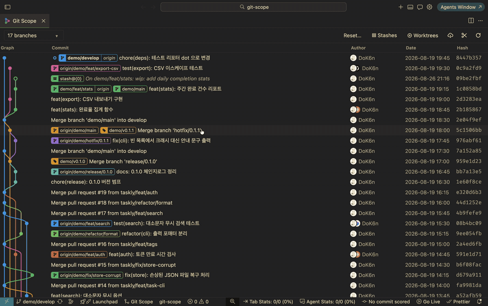

# Git Scope



> A clean-room reimplementation of the Git Graph concept, rebuilt from scratch with modern improvements. Not derived from the original source code.

A VS Code / Cursor extension that visualizes your commit graph and lets you run git actions directly from it.

## Usage

Click **Git Scope** in the left side of the status bar, or use Command Palette (`Cmd+Shift+P`) → **Git Scope: View Git Graph**. Press `Cmd/Ctrl+F` in the graph to open the Find widget; close it with `Escape` or the × button.

## Features

- **Commit graph**: branch lanes & colors, local/remote/tag badges (combined `branch | origin` badges), HEAD indicator, incremental loading on scroll; a commit's graph line highlights on mouse hover and stays highlighted while its details are open

- **Commit details**: inline expansion below the row, changed files as an icon-themed tree or flat list with `(+added | -removed)` line stats, hover actions to copy a file's absolute path or open it in the editor, click to open diffs, commit comparison via Ctrl/Cmd+click
- **Actions**: checkout (double-click a badge to `git switch`), create/delete/rename branches, merge, rebase, cherry-pick, revert, drop, tag, stash, push/pull — destructive actions always require confirmation
- **Branch drag & drop**: drag a local or remote branch badge onto a local branch to merge or rebase

- **Enhanced git reset**: choose `--soft` / `--mixed` / `--hard` with a commit target or `HEAD~N`, plus an "undo this commit" shortcut
- **Worktree management**: list/add/remove/move/lock worktrees, worktree badges on the graph, open in a new or current window
- **IDE-style Find**: `Cmd/Ctrl+F` opens a top-right Find widget with result position, previous/next navigation, match-case, whole-word and regex options, search history, and no-result feedback
- **Branch filters**: instant glob patterns (`feature/*`, `release-[0-9]*`), Tree/List views, and a Show Remote Branches toggle
- **fetch --prune**: clean up deleted remote branch references right from the fetch button
- **Avatars**: GitHub profile pictures (with disk cache and GitHub sign-in support), Gravatar fallback, and AI co-author icons for `Co-authored-by` trailers
- Auto-refresh: the graph follows any `.git` change — actions in the app or commands in your terminal

## Telemetry

Git Scope collects anonymous usage telemetry to understand which features are used and to catch failures: extension activation, graph opens, and git action events (action name, success/failure, duration only). **It never collects repository content** — no commit messages, branch names, file paths, remote URLs, or error text. See [`telemetry.json`](telemetry.json) for the full list of events.

Telemetry respects VS Code's `telemetry.telemetryLevel` setting — set it to `off` to disable.

## Development

```bash
npm install
npm run build      # host (esbuild) + webview (vite)
npm run check      # typecheck + lint + tests
```

Local packaging: `npx @vscode/vsce package --no-dependencies`

## License

MIT
